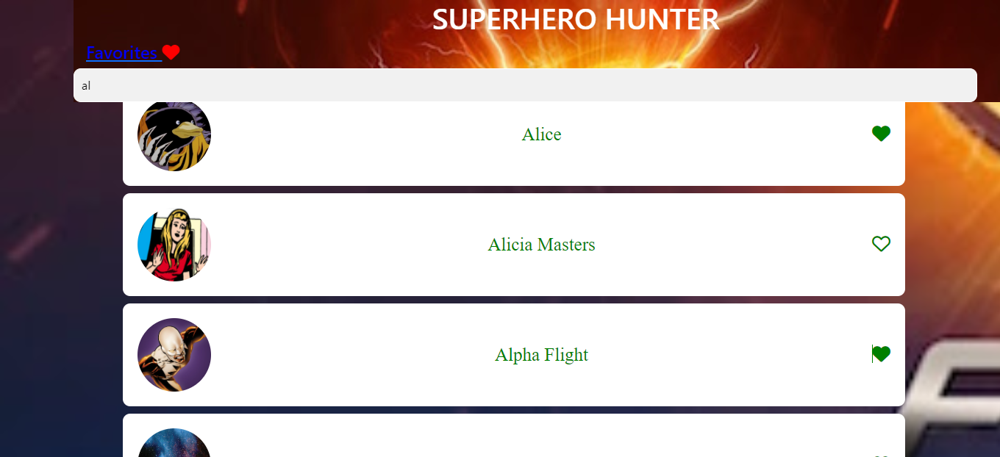
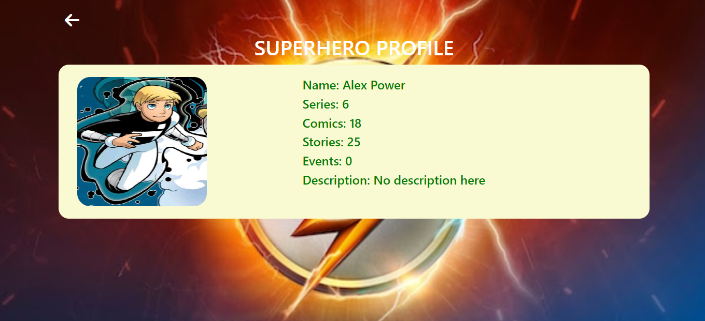
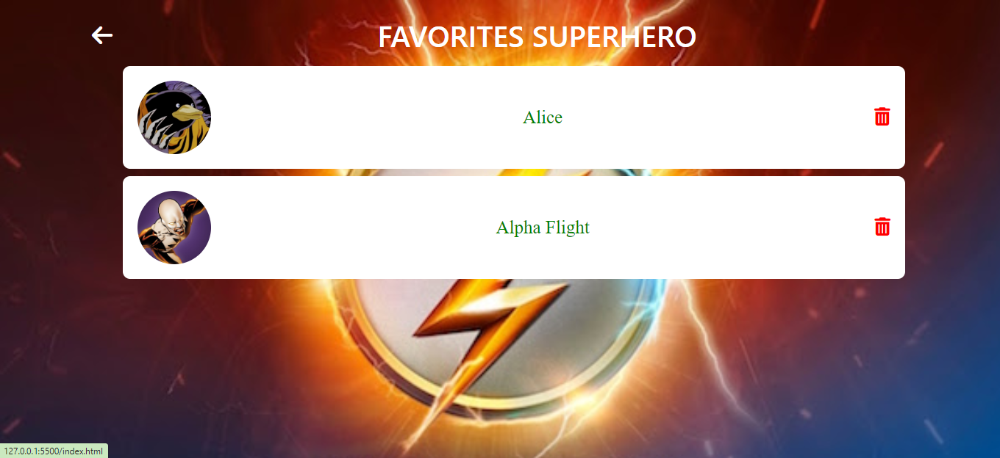
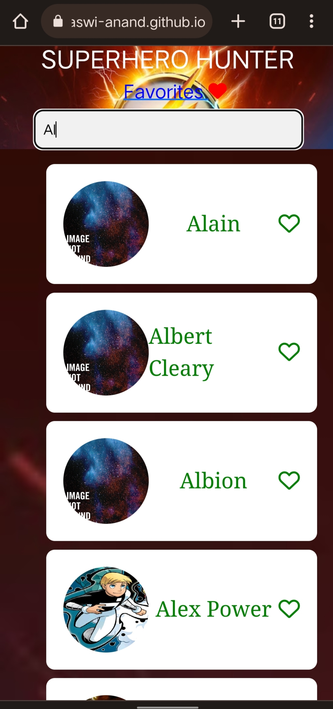

<h1> Superhero Hunter </h1>

 
    It is a simple web application that shows the list of a superhero using marvel API. 
    Also, see the profile of superheroes and add them to the favorites list.

<h3> Features: </h3>

<ul>
    <li>List of superhero.</li>
    <li>Full profile of superhero</li>
    <li>See the favorites list of superhero</li>
</ul>

<h3> Technology used: </h3>

<ul>
    <li>HTML</li>
    <li>CSS</li>
    <li>JavaScript</li>
</ul>

<h3> ScreenShots: </h3>

<h5> Desktop View: </h5>

    
    
    

<h5> Mobile View: </h5>

    
    
    

